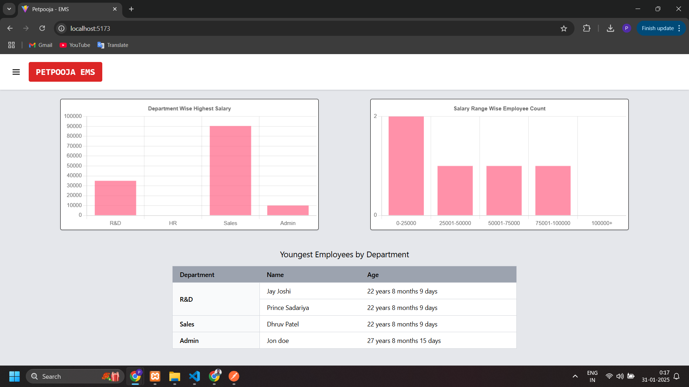

# Petpooja EMS

## Key Technologies Used

-   **Tailwind CSS**: A utility-first CSS framework for building custom designs quickly.
-   **Joi**: A powerful schema description and validation library used for backend validation.
-   **Multer**: A middleware for handling multipart/form-data, which is used for file uploads in the backend.
-   **React Hook Form**: A library for managing form state and validation in React with minimal re-rendering.
-   **Chart.js**: A JavaScript library used to create interactive bar charts and other types of visualizations.
-   **React Toastify**: A library to display toast notifications in React, used for user messages and alerts.

### Screenshot of Dashboard



## Setup Instructions for Local Development

### 1. Create a `.env` file in the `server` folder

In your **`server`** folder, create a file named `.env` and paste the following content into it:

```plaintext
DB_HOST=localhost
DB_USER=root
DB_PASSWORD=
DB_NAME=petpooja_ems
DB_PORT=3306

PROJECT_ROOT_PATH=D:\Study\Projects\Petpooja EMS\

```

-   Here `PROJECT_ROOT_PATH` helping me for upload images direct to react's public folder.
-   So in react we can access uploaded images directly

To set up the database locally, follow these steps:

-   First, create the database in your local MySQL environment.

-   In `lib` folder I have put the script file for database (import that in your database)

## Installing Dependencies for Both Projects

First run this command to install root folder's dependency:

```bash
npm install
```

To install dependencies for both the **server** and **client** projects, run the following command from the **main project folder**:

```bash
npm run i-both
```

## Starting Development Servers

After installing the dependencies, you can start both the **client** and **server** development servers by running the following command:

```bash
npm run dev
```

-   The **backend server** will run on **port 5000**.
-   The **frontend (React)** development server will run on **http://localhost:5173/**.
